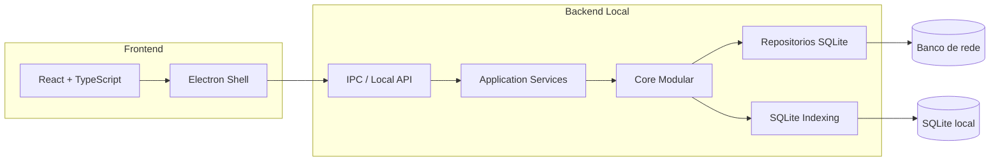

# Master Execution Plan — ICT Master Suite Premium

## Proposito do documento

Plano executivo continuo da evolucao tecnica do projeto. Consolida o diagnostico atual, o roadmap por horizonte (curto/medio/longo prazo), o backlog priorizado, a estrategia de migracao hibrida (Electron + React + core Python) e os criterios objetivos para considerar o sistema production-ready.

Este documento e ponto de referencia continuo. Atualizacoes futuras devem ser feitas diretamente aqui, evitando duplicacao em outros docs.

## 1. Estado atual do projeto

### 1.1 Arquitetura atual

- UI desktop PyQt5 ativa em `src/app_desktop/ui_main.py`.
- Threads (busca, file load, dashboard, reindex) em `src/app_desktop/threads.py`.
- Camada de aplicacao em `src/application/services/` com:
  - `LogSearchService`
  - `LogAnalysisService`
  - `LogIndexApplicationService`
  - `WikiService`
  - `AuthApplicationService`
  - `ReportApplicationService`
  - `SyncApplicationService`
  - `DatabaseApplicationService`
- Core modular em `src/core/`: `auth`, `config`, `database`, `failures`, `indexing`, `parsers`, `reports`, `sync`, `wiki`.
- Infraestrutura em `src/infrastructure/`: `file_system`, `sqlite`.
- Runner com instrumentacao de startup em `run_desktop.py` e `src/shared/startup_profiler.py`.
- Tarefas pesadas adiadas via `QTimer.singleShot(0, self._run_post_startup_tasks)` em `src/app_desktop/ui_main.py`.
- Runners Windows: `scripts/run_desktop.bat`, `scripts/run_desktop.ps1`.
- Validacao local: `scripts/dev_check.bat`, `scripts/smoke_check.py`.
- Auditoria de dependencia da facade: `scripts/find_facade_usage.py`, `scripts/find_unused_facade_exports.py`.
- Indexacao manual: `scripts/build_log_index.py` (incremental e `--rebuild`).

### 1.2 Fase atual

- Fase 3 em andamento, com sub-etapas 3.1 a 3.15 ja entregues.
- Ultimo marco: criacao do checklist operacional `docs/VALIDACAO_INDEXACAO_BUSCA_RAPIDA.md`.
- Foco imediato: estabilizar completamente a versao PyQt5 Premium antes da migracao hibrida.

### 1.3 Funcionalidades concluidas

Por dominio:

- Autenticacao e usuarios: migrados para `AuthApplicationService`.
- Wiki/base de conhecimento: migrada para `WikiService`.
- Falhas e analises: migradas para `LogAnalysisService`, com persistencia em `failure_repository`.
- Relatorios: migrados para `ReportApplicationService`.
- Sincronizacao offline e espelho local: migrados para `SyncApplicationService`.
- Conectividade de banco na UI: migrada para `DatabaseApplicationService`.
- Configuracao: migrada para `core/config/config_service`.
- Busca de logs: scanner com filtro centralizado em `LogSearchService.should_include_file`, limite seguro `limit_results` (max 500), resumo via `search_summary` e mensagem na status bar.
- Indexacao local: SQLite com schema incremental (`extension`, `size_bytes`, `indexed_at`), `LogIndexService.index_file`, `build_incremental_index`, `clear_index`, `count_entries`.
- Busca hibrida: `LogSearchService.search_with_index` ativada na `BuscaThread` com fallback automatico via `None`/excecao.
- Feedback de origem: status bar mostra `Busca rapida:` (index) ou `Busca em rede:` (scanner).
- Reindexacao manual:
  - via script: `python scripts/build_log_index.py --rebuild`
  - via UI: botao admin em Configuracoes do Sistema usando `ReindexThread`
- Diagnostico de startup: `startup_profiler` com marcas em `run_desktop.py` e `ui_main.py`; pos-startup adiado para apos primeira renderizacao.
- Runners Windows e fluxo de execucao confiavel sem ativacao manual da venv.
- Auditoria controlada da `legacy_facade` com scripts dedicados.

### 1.4 Estado da legacy_facade

- Reduzida ao proprio modulo `src/app_desktop/legacy_facade.py` mais reexport em `src/app_desktop/__init__.py`.
- Funcoes ainda expostas para compatibilidade retroativa (DB):
  - `conectar_banco`
  - `init_db`
  - `verificar_conexao_db`
  - `bootstrap_database`
- UI desktop nao depende mais diretamente da facade (auditado).

### 1.5 Estado dos testes

- 31 arquivos de teste em `tests/` cobrindo:
  - Parsers TRI, AGILENT, factory, type detector.
  - Application services (auth, wiki, report, sync, database, log search/index, log analysis em variantes de fluxo).
  - Indexing core (repository, incremental).
  - Threads (`ReindexThread` contract, hybrid search logic).
  - Scripts (`build_log_index_script`, `rebuild_index`).
- Pipeline local em `scripts/dev_check.bat`: `compileall src` + smoke check + `pytest tests`.
- Sem CI remoto, sem cobertura formal medida (sem `coverage`/`pytest-cov`).

### 1.6 Estado dos scripts

- Execucao Windows: `run_desktop.bat`, `run_desktop.ps1` com criacao automatica da `.venv`.
- Smoke: `smoke_check.py` valida arquivos chave e imports criticos com tolerancia a ausencia do PyQt5.
- Indexacao: `build_log_index.py` com modo incremental e `--rebuild`.
- Auditoria: `find_facade_usage.py` e `find_unused_facade_exports.py`.
- Sem script de release/build automatizado.

### 1.7 Estado do fluxo de execucao

- `scripts/run_desktop.bat` -> cria/ativa venv -> instala `requirements.txt` -> chama `python run_desktop.py`.
- `run_desktop.py` instrumenta startup, registra `crash_log.txt` em encerramento rapido ou excecao critica e delega para `src.app_desktop.ui_main.main`.
- `MainApp` instancia services, sobe UI, agenda `_run_post_startup_tasks` (timer de sync, FileSystemModel root, `limpar_cache_local`, purge de backups antigos).

### 1.8 Riscos restantes

Mapeados como riscos relevantes, mas sem alterar nada agora:

- Caminhos de rede e IP hardcoded em `src/core/config/config_service.py` (`DEFAULT_CONFIG`) e em `src/infrastructure/sqlite/sqlite_paths.py` (`DB_PATH`).
- Admin com senha default `admin123` (hash sha256) criado em `init_db` e `init_db_local` para preservar comportamento legado.
- `requirements.txt` sem versoes pinadas (`PyQt5`, `PyQtChart`, `pandas`, `openpyxl`).
- Ausencia de pipeline CI remoto.
- Ausencia de pipeline de build/release reprodutivel (sem `version.json` ativo, sem spec PyInstaller versionada).
- Validacao operacional ainda manual (smoke desktop e checklist da busca rapida).
- `legacy_facade` ainda exporta funcoes de DB usadas indiretamente.

## 2. Roadmap continuo

### 2.1 Curto prazo (1 a 4 semanas)

- Fechar Fase 3 com qualidade:
  - executar `docs/VALIDACAO_INDEXACAO_BUSCA_RAPIDA.md` em ambiente real e registrar evidencias
  - medir baseline de tempo busca em rede x indice
  - decidir politica de reindex (manual, agendada, sob trigger explicito)
- Estabilizacao operacional da versao PyQt5 atual:
  - validar smoke `docs/SMOKE_TEST_DESKTOP.md` periodicamente
  - capturar relatorios de `startup_profiler` em pelo menos 2 ambientes (rede local e remota)
- Higienizacao tecnica leve (apenas planejada, sem executar nesta rodada de docs):
  - pinar versoes em `requirements.txt`
  - tornar caminhos de rede e DB plenamente configuraveis (UI ja permite, faltando tirar defaults sensiveis)

### 2.2 Medio prazo (1 a 3 meses)

- Fase 4 — UI Premium PyQt5:
  - refino visual usando `style.qss` sem alterar fluxo
  - extracao gradual de widgets reutilizaveis em `src/app_desktop/widgets/`
  - melhor feedback de progresso em operacoes longas (ex.: barra para reindex)
- Fase 5 — Estabilidade e Build:
  - CI minimo (compileall + pytest + smoke check)
  - PyInstaller `*.spec` versionado e reprodutivel
  - `version.json` + integracao com `updater.py`
  - releases formais com tags SemVer
- Hardening de seguranca/configuracao:
  - troca obrigatoria da senha admin no primeiro acesso
  - remocao de defaults com IP/path da empresa em `DEFAULT_CONFIG`

### 2.3 Longo prazo (3 a 9 meses)

- Fase 6 — Arquitetura hibrida:
  - shell em Electron + UI em React/TypeScript
  - bridge IPC/local API para reaproveitar core Python
  - paridade funcional com PyQt5 antes de descontinuar
- Fase 7 — Desacoplamento total do desktop antigo:
  - congelamento e remocao controlada da `legacy_facade`
  - aposentadoria do `src/app_desktop/` apos paridade completa do Electron
  - manutencao apenas como referencia historica (similar a `legacy/finder_logs_original`)

## 3. Backlog tecnico priorizado

### 3.1 Critico

- Definir politica oficial de reindex (manual + agendada) e documentar.
- Medir e registrar baseline real de busca: `scanner` x `index` em diferentes volumes.
- Pinar `requirements.txt` para evitar drift de PyQt5/pandas/openpyxl em maquinas novas.
- Remover defaults com IP/path do `DEFAULT_CONFIG` em `config_service.py`; manter chaves vazias e exigir preenchimento via UI.
- Forcar troca de senha do admin no primeiro acesso (frontend) antes de expor em ambientes maiores.

### 3.2 Importante

- Adicionar `coverage`/`pytest-cov` ao pipeline e definir minimo por dominio.
- Criar CI remoto (GitHub Actions) com matrix Windows + Linux para `pytest` (parsers/services puros) e Windows para smoke desktop.
- Versionar PyInstaller `.spec` (atualmente em `.gitignore`) com profile dedicado para build.
- Introduzir log estruturado leve (ex.: `logging` configurado por modulo) substituindo `print(...)` em `core` e `application`.
- Expor estado do indice na UI (apenas leitura: total indexado, ultima reindexacao) sem alterar layout.

### 3.3 Melhoria futura

- Cache LRU em memoria para metadados de log abertos com frequencia.
- Suporte a paralelismo controlado na varredura de rede (ex.: `concurrent.futures` com pool pequeno) com fallback seguro.
- Migrar partes do core para `asyncio` no backend hibrido (apenas na fase Electron).
- Telemetria opcional anonimizada (tempo de busca, fallback para scanner).
- Internacionalizacao (PT-BR / EN) preparando para Electron.

## 4. Proximas fases sugeridas (detalhadas)

### 4.1 Fase 3 restante

- Executar `docs/VALIDACAO_INDEXACAO_BUSCA_RAPIDA.md` em ambiente real.
- Registrar:
  - tempo de reindex completo
  - tempo medio de busca via index
  - tempo medio de busca via scanner
  - taxa de fallback (quantas buscas caem no scanner)
- Adicionar metricas leves no `LogSearchService` (sem alterar contrato da UI).
- Criar agendamento opcional de reindex (timer/cron Windows), apenas com flag explicita.
- Critterio de saida: 2 execucoes consecutivas do checklist `Aprovado` em ambientes distintos.

### 4.2 Fase 4 — UI premium PyQt5

- Refatorar `setup_finder`, `setup_knowledge_base`, `setup_history_tab`, `setup_admin_tab`, `setup_config_tab` para arquivos separados em `src/app_desktop/widgets/`.
- Manter o mesmo `MainApp` como orquestrador.
- Refinar `style.qss` com tema claro/escuro opcional.
- Adicionar barra de progresso real para `ReindexThread` (sem mudar fluxo).
- Critterio de saida: zero regressao em `SMOKE_TEST_DESKTOP.md`.

### 4.3 Fase 5 — Estabilidade e Build

- Pinar `requirements.txt` (`PyQt5==X.Y.Z`, `PyQtChart==X.Y.Z`, `pandas==X.Y.Z`, `openpyxl==X.Y.Z`).
- Criar `requirements-dev.txt` com `pytest`, `pytest-cov`.
- Criar `pyinstaller/ict_master_suite.spec` versionado com `--noconfirm` e onedir.
- Criar `version.json` com SemVer e integrar com `updater.py`.
- Criar workflow `.github/workflows/ci.yml`:
  - jobs: `lint` (compileall), `tests` (pytest), `smoke` (smoke_check).
- Critterio de saida: build reprodutivel a partir de tag git.

### 4.4 Fase 6 — Arquitetura hibrida (Electron + React)

- Estabelecer monorepo (ver secao 5).
- Implementar bridge IPC/local API expondo `application.services` (ver secao 5).
- Reproduzir telas em React: Finder, Wiki, Historico, Admin, Config.
- Manter `app_desktop` PyQt5 ativo em paralelo ate paridade.
- Critterio de saida: 100% das funcoes de `SMOKE_TEST_DESKTOP.md` reproduzidas via Electron.

### 4.5 Fase 7 — Desacoplamento total

- Congelar `legacy_facade.py`: marcar `__all__` como deprecated e adicionar warning de import.
- Remover reexport em `src/app_desktop/__init__.py` apos zero uso (auditavel pelos scripts existentes).
- Aposentar `src/app_desktop/` mantendo somente os imports estritamente necessarios pelo Electron, ou mover o codigo para `legacy/app_desktop_pyqt5/`.
- Critterio de saida: build oficial sem PyQt5 ativo no produto final.

## 5. Estrategia de migracao hibrida futura

### 5.1 O que continua em Python

- Core: `parsers`, `failures`, `wiki`, `auth`, `reports`, `sync`, `indexing`.
- Application services: ponto unico de orquestracao consumido pela bridge.
- Repositorios SQLite e logica de espelho/fila offline.
- Logica de indexacao incremental e rebuild.

### 5.2 O que vai para Electron (shell)

- Janela principal e ciclo de vida do app.
- System tray, atalhos, autostart no SO.
- Auto-update (substituindo `updater.py` atual).
- Empacotamento de instalador (NSIS/MSI).
- Bridge IPC com o backend Python.

### 5.3 O que vai para React + TypeScript (UI)

- Telas: Finder, Wiki, Historico, Admin, Config.
- Componentizacao reutilizavel.
- Estado global por dominio (ex.: Zustand ou Redux Toolkit).
- Forms, validacoes, listas virtualizadas para grandes volumes.

### 5.4 IPC / local API

Opcoes consideradas:

- Subprocesso Python com `stdio` JSON-RPC: simples, sem porta exposta.
- FastAPI em loopback (`127.0.0.1`): produtivo, com schemas tipados; exige cuidado de auth local.
- ZeroRPC ou nanomsg: bom desempenho mas curva de adocao maior.

Recomendacao inicial: FastAPI em loopback durante prototipo, com saida possivel para JSON-RPC stdio quando for necessario empacotamento mais simples. Manter `application.services` como ponto unico de exposicao.

### 5.5 Estrutura de monorepo proposta

```
ICT-Master-Suite-Premium/
  apps/
    desktop-electron/        # shell Electron + bootstrap React
    web-ui/                  # React + TypeScript
  services/
    core-python/             # core + application services + indexing + repos
  packages/
    shared-contracts/        # tipos compartilhados (TS gerados a partir de schemas)
  legacy/                    # finder_logs_original (congelado)
  docs/                      # planos, checklists, evolution log
  scripts/                   # automacoes Windows e dev helpers
```

### 5.6 Diagrama da arquitetura alvo



## 6. Estrategia de testes

- Unitarios:
  - `core/parsers/*` (TRI/AGILENT/factory/detector).
  - `core/indexing/*` (repository/service incremental).
  - utilitarios em `infrastructure/file_system`.
- Integracao com mocks:
  - todos os `application/services/*`, mantendo padrao atual em `tests/application`.
- Smoke:
  - `scripts/smoke_check.py` validando arquivos chave e imports criticos.
  - `scripts/dev_check.bat` agregando compileall + smoke + pytest.
- Validacao operacional:
  - `docs/SMOKE_TEST_DESKTOP.md` (geral).
  - `docs/VALIDACAO_INDEXACAO_BUSCA_RAPIDA.md` (busca/index/fallback).
- Futuro Electron:
  - testes unitarios via Vitest no React.
  - testes e2e leves via Playwright em modo Electron.

Cobertura alvo gradual: 70% por dominio em `core` e `application` antes de iniciar Fase 6.

## 7. Estrategia de performance

- Indexacao:
  - manter `build_incremental_index` como caminho padrao
  - usar `--rebuild` apenas em janelas controladas
  - persistir resumo (indexed/errors) para diagnostico
- Cache:
  - manter backup local em `backup_local_dir`
  - introduzir LRU em memoria para metadados parseados (futuro)
- Busca hibrida:
  - manter `search_with_index` antes do scanner
  - manter `should_include_file` + `limit_results` para previsibilidade
  - registrar metricas de fallback
- Startup:
  - manter `startup_profiler` ativo
  - manter `_run_post_startup_tasks` adiado via `QTimer.singleShot(0, ...)`
  - desativar auto-checagem de updates pesada no boot (ja desativada)
- Concorrencia:
  - manter `QThread` para operacoes IO bound de UI
  - migrar progressivamente para `asyncio` no backend Python da fase Electron, mantendo `services` agnosticos

## 8. Estrategia de releases

- Versionamento: SemVer (`MAJOR.MINOR.PATCH`) refletido em `version.json`.
- Builds:
  - Fase atual: build manual via PyInstaller (sem spec versionada ainda).
  - Fase 5: spec versionada + script de empacotamento + assinaturas (quando aplicavel).
- Changelog:
  - manter `CHANGELOG.md` no padrao Keep a Changelog (`Unreleased`, releases datadas).
  - cada release deve consolidar entradas de `Unreleased` para o numero de versao.
- Releases GitHub:
  - tag `vX.Y.Z` apos passar `dev_check` e checklists operacionais.
  - assets: instalador onedir/onefile + `version.json` para o `updater.py`.
- Suporte a hotfix:
  - branches `hotfix/*` curtas, permitindo retorno ao `main` rapido.

## 9. Criterios para "production-ready"

O sistema sera considerado production-ready quando, simultaneamente:

1. `scripts/dev_check.bat` passar sem erros em pelo menos 2 maquinas distintas.
2. Todos os testes em `tests/` verdes em CI remoto.
3. Cobertura minima documentada por dominio (alvo inicial: 70% em `core` e `application`).
4. `requirements.txt` com versoes pinadas e build reprodutivel.
5. Sem IPs ou paths hardcoded em `DEFAULT_CONFIG`/`sqlite_paths.py`.
6. Admin com troca obrigatoria de senha no primeiro acesso.
7. `docs/SMOKE_TEST_DESKTOP.md` aprovado em pelo menos 1 release recente.
8. `docs/VALIDACAO_INDEXACAO_BUSCA_RAPIDA.md` aprovado em pelo menos 1 release recente.
9. Build PyInstaller versionado (spec versionada e tag git correspondente).
10. Release oficial publicada no repositorio com `version.json` e CHANGELOG consolidado.

## 10. Apendice — rastreabilidade

| Fase | Documentos relacionados | Arquivos principais |
|------|--------------------------|---------------------|
| Fase 1 — Modularizacao | `docs/FASE_1_MODULARIZACAO.md` | `src/core/*`, `src/infrastructure/*` |
| Fase 2 — Application services | `docs/FASE_2_APPLICATION_SERVICES.md`, `docs/FASE_2_CHECKPOINT.md`, `docs/FACADE_AUDIT.md`, `docs/FACADE_COMPATIBILIDADE.md` | `src/application/services/*`, `src/app_desktop/legacy_facade.py` |
| Fase 3 — Performance/indexacao | `docs/FASE_3_PERFORMANCE_LOGS.md`, `docs/FASE_3_INDEXACAO.md`, `docs/VALIDACAO_INDEXACAO_BUSCA_RAPIDA.md` | `src/application/services/log_search_service.py`, `src/application/services/log_index_application_service.py`, `src/core/indexing/*`, `src/app_desktop/threads.py`, `scripts/build_log_index.py` |
| Fase 3.15 — Startup | `docs/RUN_DESKTOP_WINDOWS.md`, `docs/SMOKE_TEST_DESKTOP.md` | `run_desktop.py`, `src/shared/startup_profiler.py`, `src/app_desktop/ui_main.py`, `scripts/run_desktop.bat`, `scripts/run_desktop.ps1` |
| Master Planning | `docs/MASTER_EXECUTION_PLAN.md`, `docs/PROJECT_EVOLUTION_LOG.md` | (este documento) |

## 11. Princípios para uso continuo deste plano

- Tratar este documento como vivo: editar inline conforme o projeto evolui.
- Toda fase concluida deve atualizar:
  - `docs/MASTER_EXECUTION_PLAN.md` (este arquivo).
  - `docs/PROJECT_EVOLUTION_LOG.md` (entrada datada).
  - `CHANGELOG.md` (`Unreleased`).
- Mudancas de codigo continuam restritas aos seus PRs/commits especificos; este plano nao substitui revisao tecnica.
- Sem alterar legado em `legacy/finder_logs_original`.
