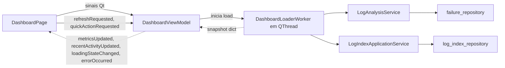
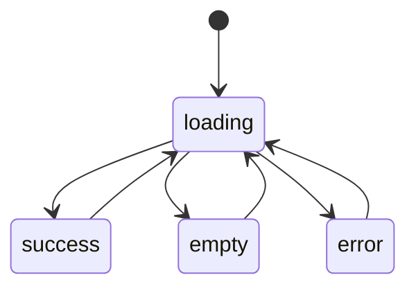

# Subfase 4.2 — Dashboard Premium

Planejamento completo da segunda subfase da Fase 4 (UI Premium PyQt5). Este documento e a fonte de verdade para a implementacao da pagina de dashboard, que sera executada em rodada posterior. Nao executa codigo nesta etapa.

Em conformidade com [docs/PHASE_4_UI_PREMIUM_PLAN.md](PHASE_4_UI_PREMIUM_PLAN.md) (secao 11.4.2 e guidelines da secao 12) e com o estado atual ja consolidado na Subfase 4.1 (`themes/`, `widgets/`, `layouts/`, `theme_loader`).

## 1. Objetivo da Subfase 4.2

Construir um dashboard premium PyQt5 desacoplado do `ui_main.py`, com componentes reutilizaveis, ViewModel responsavel por estado e atualizacao assincrona, estados visuais bem definidos (loading, empty, error, success) e arquitetura espelhavel em React/Electron na Fase 6. Nao altera threads, services, core, banco, indice, fluxos legados ou Wiki.

A entrega e visual e estrutural; nenhuma regra de negocio nem contrato publico de service ou thread e modificado.

## 2. Problemas atuais do dashboard

- O dashboard original foi removido na transicao para "Base de Conhecimento" (vide comentario em `src/app_desktop/ui_main.py` linha 1301: `BUGFIX: O Dashboard foi removido na versao nova (substituido pela Wiki)`). Nao ha visao consolidada de metricas hoje.
- `DashboardThread` em `src/app_desktop/threads.py` (linhas 184-194) ficou orfa apos a remocao — emite `stats_updated(dict)` mas nao e instanciada em nenhum ponto de `ui_main.py`. Esforco previo de UI assincrona desperdicado.
- Status do indice de logs e visivel apenas via Configuracoes; nao ha visao panoramica para o tecnico em uma unica tela.
- Tecnico nao tem feedback rapido de "quantas analises hoje", "quantas tratadas", "quais componentes lideram falhas".
- Nao ha estados de loading/empty/error em UI atual — operacoes longas usam apenas `status_bar.setText`, sem destaque visual.

## 3. Limitacoes atuais

- Estatisticas existem apenas em backend (`obter_estatisticas_ict`, `obter_ultimas_analises`, `obter_estatisticas_progresso` em `src/core/failures/failure_repository.py`), sem qualquer renderizacao em UI.
- Nao existem componentes de "card de metrica" reutilizaveis. As subfases 4.1 entregaram `Card`, `StatusBadge`, `PrimaryButton` e `ProgressOverlay`, mas nada especifico de dashboard.
- Layouts atuais sao fixos (`QVBoxLayout`/`QHBoxLayout` simples em `setup_*`), sem responsividade.
- `tab_dash` esta tomado pela Wiki (linha 297 de `ui_main.py`), exigindo aba nova para nao colidir.
- Sem padronizacao de feedback assincrono — cada thread se conecta a slots ad-hoc.

## 4. Estrategia visual do dashboard

- Hero header: titulo "Dashboard", subtitulo com hora da ultima atualizacao e botao Atualizar (`PrimaryButton`).
- Linha 1: 4 metric cards horizontais — Total Hoje, Abertos, Tratados, Indice (qtd arquivos).
- Linha 2: 2 paineis lado a lado — Atividade Recente + Top 5 Componentes.
- Linha 3: 1 painel (Search/Index Summary) + QuickActionsPanel.
- Tipografia, cores e spacing 100% via tokens de `src/app_desktop/themes/tokens.py` e seletores de `src/app_desktop/themes/light.qss`.
- Estados de cards: `default`, `hover`, `loading`, `empty`, `error` — todos definidos em QSS, sem `setStyleSheet(...)` inline.

## 5. Estrategia arquitetural



- MVVM leve: `DashboardPage` apenas renderiza estado e emite intents; `DashboardViewModel` orquestra worker, faz formatacao e dispara sinais; `DashboardLoaderWorker` chama services em thread propria.
- Injecao de dependencia por construtor: `DashboardViewModel(log_analysis_service, log_index_service)` — facilita teste com mocks e troca de bridges no futuro Electron/React.
- Sinais Qt nomeados em verbos de dominio (`refreshRequested`, `quickActionRequested`, `metricsUpdated`, `recentActivityUpdated`, `loadingStateChanged`, `errorOccurred`) — paridade direta com hooks React.

## 6. Estrategia de componentizacao

- 1 widget = 1 responsabilidade visual.
- Widgets nao instanciam services nem chamam repositorios.
- Estado e formatacao em `DashboardViewModel`.
- Estilizacao via `objectName`/`property` consumindo `themes/light.qss` (ampliado em 4.2 com seletores semanticos do dashboard) — nunca inline.
- Reuso obrigatorio dos componentes da Subfase 4.1 (`Card`, `StatusBadge`, `PrimaryButton`, `ProgressOverlay`, `MasterDetailLayout`).

## 7. Estrategia de desacoplamento do `ui_main.py`

Alteracoes minimas em `src/app_desktop/ui_main.py`:

- Importar `DashboardPage` de forma lazy (dentro do helper de instanciacao) — sem alterar a lista de imports do topo se possivel.
- Em `init_ui`: criar nova aba `tab_dashboard` posicionada antes de `tab_finder` (1a aba do `QTabWidget`).
- Lazy load real: criar `DashboardPage` apenas no primeiro `currentChanged` para a aba (custo zero ate ela ser ativada).
- Adicionar slot leve `_on_tab_changed(index)` que materializa a pagina sob demanda e a mantem em cache.
- Adicionar cleanup em `closeEvent`: chama `dashboard_viewmodel.shutdown()` se a pagina foi instanciada.
- Nao tocar `setup_knowledge_base`, `setup_finder`, `setup_history_tab`, `setup_admin_tab`, `setup_config_tab`.
- Nao reordenar nem renomear `self.tab_dash` (continua sendo a Wiki).

Resumo: 1 nova aba + 1 helper + 1 alteracao em `closeEvent`. Nada mais.

## 8. Estrategia de performance visual

- Lazy instantiation da pagina por `currentChanged` (custo zero ate aba ser ativada).
- `setUpdatesEnabled(False)` durante populacao em batch da `RecentActivityPanel`.
- `QTimer` opcional de refresh com intervalo default 60s (configuravel; **default off** para nao causar IO em background sem demanda explicita do usuario).
- Debounce no botao Refresh: bloquear sinal/desabilitar botao ate worker concluir; reabilitar via slot `loadingStateChanged(False)`.
- Reuso de instancia: ao trocar de aba e voltar, reusa a `DashboardPage` existente; refresh apenas via botao ou QTimer.
- Sem animacoes pesadas; transicoes simples por troca de visibilidade.

## 9. Estrategia de worker-safe UI updates

- Toda chamada a service ou repositorio acontece **dentro** de `DashboardLoaderWorker` (subclasse `QObject` rodando em `QThread`).
- Worker emite **um unico sinal** com snapshot agregado (dataclass imutavel) — UI nunca le o worker diretamente.
- ViewModel recebe snapshot, formata strings (datas, status, totais), e emite sinais especificos para a Page.
- Page atualiza widgets dentro do main thread garantido (sinais Qt fazem essa marshalling automaticamente).
- Em caso de excecao no worker: emite `loadFailed(str)` e ViewModel propaga para `errorOccurred(str)`; Page exibe error state mantendo ultimos dados validos visiveis se houver.
- Cleanup explicito em `closeEvent` da Page: `viewmodel.shutdown()` chama `thread.quit() + thread.wait(2000)` antes de retornar.

## 10. Estrutura futura recomendada

```
src/app_desktop/
  pages/
    dashboard/
      __init__.py
      dashboard_page.py
  widgets/
    dashboard/
      __init__.py
      dashboard_header.py
      metric_card.py
      status_card.py
      recent_activity_panel.py
      search_summary_panel.py
      dashboard_grid.py
      empty_state.py
      loading_state.py
      section_title.py
      quick_actions_panel.py
  viewmodels/
    dashboard/
      __init__.py
      dashboard_viewmodel.py
      dashboard_loader_worker.py
      dashboard_snapshot.py
```

A organizacao por subpasta (`widgets/dashboard/`, `viewmodels/dashboard/`, `pages/dashboard/`) deixa explicito o escopo de cada componente e facilita refatoracoes/migracao futura para paginas React equivalentes (`apps/web-ui/components/dashboard/`).

## 11. Componentes planejados

Para cada componente: objetivo, props/inputs, dependencias, riscos, paridade futura React/Electron.

### 11.1 DashboardHeader (`widgets/dashboard/dashboard_header.py`)

- Objetivo: header com titulo, subtitulo de "Atualizado em HH:MM:SS" e botao Atualizar.
- Props/inputs: `title: str`, `subtitle: str` (atualizavel via slot), sinal `refreshClicked` emitido no clique.
- Dependencias: `Card` e `PrimaryButton` da Subfase 4.1; tokens de `themes/tokens.py`.
- Riscos: subtitulo desatualizado se ViewModel nao notificar; mitigado por sinal `metricsUpdated` que reformata o subtitulo a cada snapshot.
- Futuro React: componente `<DashboardHeader title subtitle onRefresh />` em `apps/web-ui/components/dashboard/`.

### 11.2 MetricCard (`widgets/dashboard/metric_card.py`)

- Objetivo: card com titulo, valor numerico grande e legenda opcional.
- Props/inputs: `title: str`, `value: str | int`, `caption: Optional[str]`, `tone: Literal['neutral','positive','negative','warning']`.
- Dependencias: `Card`, `StatusBadge` (opcional como tone indicator).
- Riscos: numero grande estourar largura em monitores pequenos; mitigado por reducao de `font-size` no breakpoint < 800px e `setMinimumWidth` por tone.
- Futuro React: `<MetricCard title value caption tone />`.

### 11.3 StatusCard (`widgets/dashboard/status_card.py`)

- Objetivo: card mostrando estado binario/categorico (DB Online/Offline, Indice Disponivel/Indisponivel).
- Props/inputs: `title: str`, `kind: Literal['pass','fail','warning','info','neutral']`, `description: str`.
- Dependencias: `Card`, `StatusBadge`.
- Riscos: `kind` incoerente com valores reais; mitigado pela formatacao centralizada no ViewModel (mapeia `db_online -> pass/fail`, `index_ready -> pass/warning`).
- Futuro React: `<StatusCard title kind description />`.

### 11.4 RecentActivityPanel (`widgets/dashboard/recent_activity_panel.py`)

- Objetivo: lista das ultimas analises (data, serial, componente, status badge).
- Props/inputs: `items: List[ActivityItem]` (dataclass com 4 campos formatados).
- Dependencias: `Card`, `StatusBadge`, `SectionTitle`, `QListView` ou `QTableWidget` simples.
- Riscos: render pesado com >1000 itens; mitigado por limite de 10 (`get_latest_analyses(10)` ja limita) e `setUpdatesEnabled(False)` em populate.
- Futuro React: `<RecentActivityPanel items />`.

### 11.5 SearchSummaryPanel (`widgets/dashboard/search_summary_panel.py`)

- Objetivo: visao do estado da busca hibrida — origem padrao (index/scanner), total de arquivos no indice, ultima reindex (se disponivel via `LogIndexApplicationService`), tempo medio recente (futuro/integracao 4.3).
- Props/inputs: `index_size: int`, `index_ready: bool`, `last_reindex: Optional[str]`, `last_search_origin: Optional[Literal['index','scanner']]`.
- Dependencias: `Card`, `StatusBadge`, `SectionTitle`.
- Riscos: depender de sinais externos para `last_search_origin` (vem de `BuscaThread.search_summary`); mitigado deixando opcional na Subfase 4.2 (mostra apenas estado do indice; integracao com `BuscaThread` fica para 4.3).
- Futuro React: `<SearchSummaryPanel ... />`.

### 11.6 DashboardGrid (`widgets/dashboard/dashboard_grid.py`)

- Objetivo: layout responsivo que organiza cards em colunas dinamicas conforme largura disponivel.
- Props/inputs: API `add_row(*widgets, weights=None)`; reage a `resizeEvent` ajustando wrap conforme breakpoints.
- Dependencias: PyQt5 puro (`QGridLayout` + logica custom de breakpoint).
- Riscos: bug de wrap em telas estreitas; mitigado por 3 breakpoints (>=1200px linhas completas; >=800 reorganiza para 2 colunas; <800 vira 1 coluna).
- Futuro React: `<Grid responsive>` com Tailwind cols (`md:grid-cols-2 lg:grid-cols-4`).

### 11.7 EmptyState (`widgets/dashboard/empty_state.py`)

- Objetivo: placeholder quando dados ausentes (DB offline ou primeiro uso).
- Props/inputs: `title: str`, `message: str`, `action_label: Optional[str]`, sinal `actionClicked`.
- Dependencias: `Card`, `PrimaryButton`.
- Riscos: confusao com erro; mitigado por tom visual neutro (sem cores de error vermelhas).
- Futuro React: `<EmptyState ... />`.

### 11.8 LoadingState (`widgets/dashboard/loading_state.py`)

- Objetivo: skeleton placeholder durante load inicial — pode usar 4 `Card` cinzas + animacao opcional, ou versao reduzida do `ProgressOverlay` da 4.1 ancorada na pagina.
- Props/inputs: `message: str = "Carregando..."`.
- Dependencias: `ProgressOverlay` (reuso) ou skeleton custom.
- Riscos: `QPropertyAnimation` consome CPU em desktops antigos; mitigado por toggle simples (sem animacao default).
- Futuro React: `<DashboardSkeleton />` com `animate-pulse` do Tailwind.

### 11.9 SectionTitle (`widgets/dashboard/section_title.py`)

- Objetivo: titulo padronizado de secoes (`Atividade recente`, `Top 5 componentes`, `Status do indice`).
- Props/inputs: `text: str`, `subtitle: Optional[str]`.
- Dependencias: `QLabel` + tokens de tipografia.
- Riscos: nenhum.
- Futuro React: `<SectionTitle text subtitle />`.

### 11.10 QuickActionsPanel (`widgets/dashboard/quick_actions_panel.py`)

- Objetivo: botoes de atalho — "Reindexar logs" (admin), "Abrir Finder", "Abrir Wiki", "Abrir Configuracoes" (admin).
- Props/inputs: `is_admin: bool`, sinal `actionRequested(name: str)`.
- Dependencias: `PrimaryButton`, `Card`.
- Riscos: aciona reindex acidentalmente; mitigado com confirmacao via `QMessageBox` (mantendo `QMessageBox` para acoes destrutivas conforme orientacao da Subfase 4.5).
- Futuro React: `<QuickActions actions onAction />`.

## 12. Estrategia de metricas

Snapshot do worker (dataclass imutavel) tera o seguinte shape:

```python
@dataclass(frozen=True)
class DashboardSnapshot:
    total_hoje: int
    abertos: int
    tratados: int
    top_componente: str
    top_5_componentes: list   # [(componente, qtd), ...]
    db_online: bool
    index_size: int
    index_ready: bool
    recent_activity: list      # [(data, serial, componente, status), ...]
    generated_at: str          # ISO timestamp
```

Fontes:

- `LogAnalysisService.get_ict_statistics()` -> `total_hoje`, `top_componente`, `top_5_componentes`, `db_online`.
- `LogAnalysisService.get_progress_statistics()` -> `abertos`, `tratados`.
- `LogAnalysisService.get_latest_analyses(10)` -> `recent_activity`.
- `LogIndexApplicationService` (verificar nome real do metodo de tamanho/disponibilidade na execucao; fallback derivado de `is_index_ready` consumido hoje pelo `LogSearchService`).

ViewModel formata datas com `datetime.fromisoformat(...).strftime("%H:%M")` e mapeia `status` -> `kind` (`TRATADO -> pass`, `EM_ABERTO -> warning`, default `neutral`).

## 13. Estrategia de atualizacao assincrona

`DashboardLoaderWorker(QObject)`:

- Slot `start_load()` chamado via `QMetaObject.invokeMethod(self, "start_load", Qt.QueuedConnection)`.
- Executa as 4 chamadas a services em sequencia (ou paralelo via `QtConcurrent` em rodada futura, se houver demanda).
- Emite `snapshotReady(DashboardSnapshot)` em sucesso ou `loadFailed(str)` em erro.

`DashboardViewModel`:

- Mantem instancia unica de `QThread` + worker (move via `worker.moveToThread(thread)`); inicia `thread` no `__init__`.
- `refresh()` -> `loadingStateChanged.emit(True)` -> agenda `start_load()` via `invokeMethod`.
- Recebe `snapshotReady` -> formata -> emite sinais especificos -> `loadingStateChanged.emit(False)`.
- Recebe `loadFailed` -> emite `errorOccurred(msg)`.
- `shutdown()` -> `thread.quit()` + `thread.wait(2000)`.

`DashboardPage`:

- Conecta sinais do ViewModel a slots de update.
- Conecta cliques (header refresh, quick actions) a `refreshRequested` / `quickActionRequested` do ViewModel.

## 14. Estrategia de estados visuais

Estados gerenciados pelo ViewModel via enum `DashboardUiState`:

- `loading`: `LoadingState` visivel sobre `DashboardGrid` (cards renderizam vazios), `PrimaryButton` Refresh desabilitado.
- `empty`: `EmptyState` substitui `DashboardGrid` quando `db_online=False` E `index_ready=False`.
- `error`: banner `Card` com `kind=fail` no topo + mensagem; tela continua mostrando ultimos dados validos se houver.
- `success`: estado normal com cards populados.

Transicoes:



## 15. Estrategia de design system

- Cores: usa tokens existentes em `src/app_desktop/themes/tokens.py`; nenhum hex novo.
- Tipografia: hierarquia explicita — `size_xxl` no titulo do header, `size_xl` no valor numerico das metric cards, `size_md` em labels, `size_sm` em captions.
- Spacing: padding interno dos `Card` em `lg` (16px); gap entre cards em `md` (12px); margem externa do grid em `xl` (24px).
- Radius: cards `lg` (12px), badges `md` (8px), botoes `md` (6px) — alinhado com a Subfase 4.1.
- QSS: ampliar `src/app_desktop/themes/light.qss` com seletores por `objectName`/property dos novos widgets (`#metricCard`, `#statusCard`, `#dashboardHeader`, `#recentActivityPanel`, etc.) — sem tocar `style.qss` legado.

## 16. Estrategia de responsividade

- 3 breakpoints internos no `DashboardGrid` baseados em `width()`:
  - `>= 1200px`: 4 colunas em metric row, 2 em panels row.
  - `>= 800px`: 2 colunas em metric row, 1 em panels row.
  - `< 800px`: 1 coluna geral.
- `resizeEvent` recalcula layout via `_apply_breakpoint()` (idempotente; nao recria widgets, apenas reordena).
- Sem dependencia externa; PyQt5 puro.

## 17. Estrategia de testes

Pasta nova: `tests/app_desktop/dashboard/`. Cobertura prevista:

- `tests/app_desktop/dashboard/test_dashboard_snapshot.py` (sem PyQt5): valida dataclass, factories, formatacoes basicas.
- `tests/app_desktop/dashboard/test_dashboard_loader_worker.py`: mocka `LogAnalysisService` e `LogIndexApplicationService`; valida snapshot resultante e tratamento de excecao.
- `tests/app_desktop/dashboard/test_dashboard_viewmodel.py`: com `pytest.importorskip("PyQt5")` e `QSignalSpy`; valida que mock de worker faz emitir sinais corretos.
- `tests/app_desktop/dashboard/test_dashboard_widgets_import.py`: smoke import com `pytest.importorskip("PyQt5")` para todos os 10 componentes.
- `tests/app_desktop/dashboard/test_dashboard_page_smoke.py`: import + `issubclass(DashboardPage, QWidget)` (sem instanciar).

Manter padrao `pytest.importorskip("PyQt5")` para nao bloquear CI headless.

Comando recomendado para a execucao apos a implementacao:

```
python -m pytest tests/app_desktop tests/application tests/core --tb=short
```

## 18. Estrategia de rollback

- Subfase 4.2 entrega 1 commit unico (`feat(ui): premium dashboard with metric cards and viewmodel`).
- `git revert <commit>` reverte todos os arquivos novos.
- Como o unico arquivo alterado em `src/app_desktop/ui_main.py` sera o `init_ui` (adicao da aba) + um helper de lazy-load + cleanup em `closeEvent`, o revert restaura a UI exatamente ao estado pos-4.1.
- `tab_dash` (Wiki), `setup_*` das outras abas, `style.qss`, `threads.py` permanecem intactos — revert nao tem efeito colateral.

Em caso de regressao detectada por `dev_check.bat` ou smoke desktop, reverter o commit imediatamente; nao ha estado intermediario que precise ser limpo.

## 19. Ordem ideal de implementacao

1. **Tokens visuais do dashboard** (ampliar `themes/light.qss` com seletores dos novos widgets — sem tocar `base.qss`).
2. **Snapshot dataclass** (`viewmodels/dashboard/dashboard_snapshot.py`) + teste unitario.
3. **Worker** (`viewmodels/dashboard/dashboard_loader_worker.py`) com testes (mocks de services).
4. **ViewModel** (`viewmodels/dashboard/dashboard_viewmodel.py`) com testes (mock do worker).
5. **Componentes "puros"** sem dependencias entre si: `SectionTitle`, `MetricCard`, `StatusCard`, `EmptyState`, `LoadingState`.
6. **Componentes compostos**: `DashboardHeader`, `RecentActivityPanel`, `SearchSummaryPanel`, `QuickActionsPanel`.
7. **Layout** `DashboardGrid` com breakpoints.
8. **Pagina** `DashboardPage` integrando tudo (header + grid + panels + states).
9. **Integracao em `ui_main.py`**: nova aba lazy-loaded + cleanup em `closeEvent`.
10. **Testes de fumaca finais** e validacao via `scripts\dev_check.bat` + `pytest`.

## 20. O que NAO deve ser alterado

- `src/app_desktop/threads.py` (incluindo `DashboardThread` orfa — manter como esta para nao quebrar contrato publico).
- Application services em `src/application/services/` — apenas consumidos.
- Core em `src/core/`.
- Esquema SQLite (remoto, espelho local, fila offline, indice).
- Pasta `legacy/`.
- `style.qss` legado (`src/app_desktop/style.qss`) — mantido como fallback ate a Subfase 4.8.
- `setup_finder`, `setup_knowledge_base`, `setup_history_tab`, `setup_admin_tab`, `setup_config_tab`.
- Variavel `self.tab_dash` (continua sendo a Wiki).
- Mensagens funcionais (login, salvar analise, exportar excel) — apenas apresentacao pode mudar; conteudo nao muda.
- `requirements.txt` — sem dependencias novas.
- `run_desktop.py` — exceto pequenas marcacoes de `startup_profiler` se necessario.

## 21. Criterios para considerar a Subfase 4.2 concluida

1. Aba "Dashboard" visivel para todos os perfis (admin e nao-admin).
2. Pagina renderiza no minimo 4 metric cards (Total Hoje, Abertos, Tratados, Indice).
3. Pagina renderiza painel de Atividade Recente com 10 itens.
4. Pagina renderiza painel de Search/Index Summary com estado do indice.
5. Atualizacao assincrona via worker dedicado, sem bloquear UI.
6. Estados loading/empty/error/success funcionam e sao testados.
7. Lazy load: `DashboardPage` so instancia no primeiro `currentChanged`.
8. Botao Refresh funciona; debounce previne chamadas concorrentes.
9. Quick Actions funcionam (`Reindexar` admin, `Abrir Finder`, `Abrir Wiki`).
10. Smoke tests novos passam; nenhum teste pre-existente regride.
11. `scripts\dev_check.bat` verde.
12. `python -m pytest tests/app_desktop tests/application tests/core` verde.
13. Sem regressao em Wiki/Finder/Historico/Admin/Config.
14. Nenhuma alteracao em `threads.py`, `style.qss`, services, core, banco, indice ou legacy.
15. Nenhuma dependencia nova em `requirements.txt`.

## 22. Commits sugeridos por etapa

Modelo recomendado (1 commit unico, alinhado com o padrao das subfases 3.x e 4.1):

- `feat(ui): premium dashboard with metric cards and viewmodel`

Modelo opcional (multiplos commits, se necessario por revisao incremental):

- `feat(ui): add dashboard widgets foundation (cards, panels, states)`
- `feat(ui): add dashboard viewmodel and worker-safe loader`
- `feat(ui): add dashboard page integrated as new tab`
- `test(ui): add dashboard viewmodel and widgets smoke tests`
- `docs(ui): finalize subfase 4.2 dashboard premium`

Rollback unico via `git revert` em qualquer um dos modelos.

## 23. Riscos e mitigacoes

- **R1 — Lazy load mascara bugs ate aba ser ativada**: smoke test `test_dashboard_page_smoke.py` materializa a pagina; manual smoke abre todas abas em ordem antes de fechar.
- **R2 — Worker continua rodando ao fechar a janela**: cleanup em `closeEvent` da Page chama `viewmodel.shutdown()`; ViewModel chama `thread.quit() + thread.wait(2000)`.
- **R3 — `DashboardThread` orfa pode confundir manutencao**: documento explicita que ela permanece intocada por seguranca; remocao fica para Subfase 4.8 (Final UI Stabilization).
- **R4 — `LogIndexApplicationService` nao expor metodo de tamanho/disponibilidade**: identificar metodo correto na execucao; se ausente, snapshot omite `index_size` e mostra apenas `index_ready` derivado de `is_index_ready` (ja consumido no Finder via `LogSearchService`).
- **R5 — DB inacessivel atrasa worker**: timeout do `conectar_banco` ja eh 20s; UI nao bloqueia (worker em thread propria); Page exibe `LoadingState` ate snapshot/erro.
- **R6 — `currentChanged` dispara antes do widget estar pronto**: guard `if self._dashboard_page is None: instantiate()`.
- **R7 — `QTimer` de auto-refresh causando IO em background**: default off; so habilita se config explicita `dashboard_auto_refresh_seconds > 0` for adicionada futuramente em `core/config/config_service.py`.

## 24. Dependencias futuras habilitadas

- Subfase 4.3 (Search Experience) reusa `MetricCard`, `StatusCard`, `SectionTitle`, `EmptyState`, `LoadingState` no painel de busca.
- Subfase 4.5 (System UX) reusa `SearchSummaryPanel` como base para toasts contextuais e progress overlay de reindex.
- Subfase 4.6 (Theme & Design System) consolida selectors de `light.qss` introduzidos aqui em modulos QSS por tema.
- Subfase 4.8 (Final UI Stabilization) avalia remocao de `DashboardThread` orfa e migracao definitiva para `DashboardLoaderWorker`.
- Fase 6 (Electron/React): `DashboardSnapshot` vira contrato IPC; cada widget mapeia 1:1 para componente React (Tailwind cols em `DashboardGrid`).
