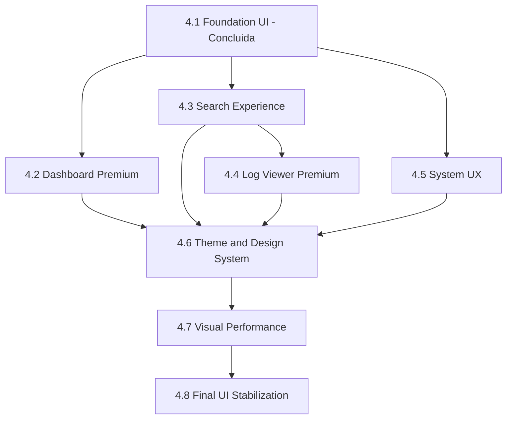

# Plano executivo de conclusao da Fase 4 — UI Premium PyQt5

Este documento e a fonte de verdade para a execucao do restante da Fase 4 (subfases 4.2 a 4.8). Cada subfase e pequena, testavel, reversivel, gera commit local e atualiza CHANGELOG e PROJECT_EVOLUTION_LOG. Nenhum push e executado por sessoes do agente; o usuario fara push manualmente.

Detalhe da Subfase 4.2 vive em [docs/PHASE_4_2_DASHBOARD_PREMIUM_PLAN.md](PHASE_4_2_DASHBOARD_PREMIUM_PLAN.md). Detalhes das 4.3 a 4.8 vivem aqui e podem ser expandidos em documentos proprios quando a respectiva subfase entrar em execucao.

## 1. Objetivo

Finalizar Fase 4 UI Premium com PyQt5 modular, organizada, documentada, testada e preparada para futura arquitetura hibrida Electron + React + TypeScript + Python Core.

A entrega e visual e estrutural; nenhuma regra de negocio, contrato publico de service, contrato de thread, esquema de banco ou pasta legacy sera modificado.

## 2. Estado atual

- Fase 4.1 (Foundation UI) **concluida** — commit local `40ca754 feat(ui): add premium foundation widgets and theme base`. Foram entregues `themes/tokens.py`, `themes/base.qss`, `themes/light.qss`, `themes/theme_loader.py`, widgets base (`PrimaryButton`, `Card`, `StatusBadge`, `ProgressOverlay`), layout `MasterDetailLayout` e fallback seguro em `MainApp.load_stylesheet`.
- Fase 4.2 **planejada** em [docs/PHASE_4_2_DASHBOARD_PREMIUM_PLAN.md](PHASE_4_2_DASHBOARD_PREMIUM_PLAN.md), pendente de execucao.
- UI ainda majoritariamente concentrada em [src/app_desktop/ui_main.py](../src/app_desktop/ui_main.py) (~1.580 linhas).
- `themes/`, `widgets/`, `layouts/`, `dialogs/`, `pages/`, `viewmodels/`, `assets/` ja existem como pacotes vazios prontos para receber as subfases seguintes.
- `style.qss` legado preservado como fallback ate a Subfase 4.8.

## 3. Regras gerais (resumo)

- Nao mexer em `legacy/`.
- Nao quebrar busca, indexacao, login, wiki, historico, relatorios, sync ou configuracoes.
- Nao alterar contratos publicos dos Application Services.
- Nao alterar `src/app_desktop/threads.py` (`BuscaThread`, `FileLoaderThread`, `DashboardThread`, `ReindexThread`).
- Nao alterar banco de dados nem esquema do indice.
- Nao adicionar dependencias novas em `requirements.txt` sem justificativa explicita.
- Nao reescrever `ui_main.py` inteiro — alteracoes pontuais e cirurgicas apenas.
- Nao iniciar Electron/React ainda.
- Nao executar `git push`.
- Cada subfase: pequena, testavel, reversivel, com commit local + CHANGELOG + PROJECT_EVOLUTION_LOG.
- Sempre rodar validacoes antes do commit.
- Sempre que possivel reusar componentes da Subfase 4.1.

## 4. Comandos de validacao padrao

```
scripts\dev_check.bat
python -m pytest tests/app_desktop tests/application tests/core --tb=short
```

Se algum teste pre-existente falhar fora do escopo, registrar claramente no relatorio da subfase, sem mascarar e sem alterar comportamento funcional para "fazer teste passar". Falha conhecida fora do escopo: `tests/parsers/test_tri_parser.py::test_parse_tri_txt_pass_serial_modelo` (debito tecnico ja mapeado).

## 5. Subfases de execucao

### 5.1 Subfase 4.2 — Dashboard Premium

- Objetivo: aba Dashboard nova, MVVM leve, worker dedicado, lazy load, estados visuais claros.
- Detalhe completo: [docs/PHASE_4_2_DASHBOARD_PREMIUM_PLAN.md](PHASE_4_2_DASHBOARD_PREMIUM_PLAN.md).
- Arquivos provaveis:
  - novos: `src/app_desktop/viewmodels/dashboard/{__init__.py, dashboard_snapshot.py, dashboard_loader_worker.py, dashboard_viewmodel.py}`; `src/app_desktop/widgets/dashboard/{__init__.py, dashboard_header.py, metric_card.py, status_card.py, recent_activity_panel.py, search_summary_panel.py, dashboard_grid.py, empty_state.py, loading_state.py, section_title.py, quick_actions_panel.py}`; `src/app_desktop/pages/dashboard/{__init__.py, dashboard_page.py}`; `tests/app_desktop/dashboard/{__init__.py, test_dashboard_snapshot.py, test_dashboard_loader_worker.py, test_dashboard_viewmodel.py, test_dashboard_widgets_import.py, test_dashboard_page_smoke.py}`.
  - alterados: `src/app_desktop/themes/light.qss` (selectors do dashboard); `src/app_desktop/ui_main.py` (init_ui adiciona `tab_dashboard` lazy + helper + cleanup em closeEvent).
- Riscos: lazy load mascara bug (mitigado por smoke test); worker vivo apos close (mitigado por cleanup); aba inserida muda indices (mitigado pois `setTabVisible(indexOf(widget))` usa referencia de widget).
- Rollback: `git revert <commit>`.
- Testes: 5 arquivos novos em `tests/app_desktop/dashboard/`.
- Criterios de conclusao: ver criterios 1-15 em [docs/PHASE_4_2_DASHBOARD_PREMIUM_PLAN.md](PHASE_4_2_DASHBOARD_PREMIUM_PLAN.md) secao 21.
- Commit esperado: `feat(ui): add premium dashboard page with viewmodel`.
- Nao alterar: `threads.py`, services, core, esquema SQLite, `legacy/`, `style.qss` legado, `setup_*` das outras abas, `self.tab_dash` (Wiki).

### 5.2 Subfase 4.3 — Search Experience Premium

- Objetivo: melhorar visual do Finder Logs com componentes reutilizaveis sem alterar logica/contratos da `BuscaThread`. Exibir origem da busca (`Busca rapida:` / `Busca em rede:`) de forma destacada usando os sinais existentes.
- Arquivos provaveis:
  - novos: `src/app_desktop/widgets/search/{__init__.py, search_panel.py, search_result_list.py, search_status_panel.py}`; `src/app_desktop/viewmodels/search/{__init__.py, finder_viewmodel.py}`; `src/app_desktop/pages/finder/{__init__.py, finder_page.py}` (extracao gradual do `setup_finder`); `tests/app_desktop/search/test_finder_viewmodel.py`.
  - alterados: `src/app_desktop/ui_main.py` (`setup_finder` consome novos widgets ou delega para `FinderPage`); `src/app_desktop/themes/light.qss` (selectors do search panel).
- Riscos: quebra de sinais `lista_arquivos`/`search_summary` da `BuscaThread`. Mitigacao: manter conexoes existentes intactas; testes de regressao via `test_finder_viewmodel.py` com `BuscaThread` mockada.
- Rollback: `git revert`.
- Testes: ViewModel com `BuscaThread` mockada; smoke import dos widgets.
- Criterios de conclusao:
  - Busca funciona identica.
  - Feedback `Busca rapida:` / `Busca em rede:` preservado.
  - Status bar global mantida.
  - Filtros visiveis e operacionais.
  - Sem regressao em `dev_check` e `pytest`.
- Commit esperado: `feat(ui): add premium log search experience`.
- Nao alterar: `BuscaThread.lista_arquivos`/`search_summary`, `LogSearchService`, `LogIndexApplicationService`, mensagens funcionais, banco.

### 5.3 Subfase 4.4 — Log Viewer Premium

- Objetivo: melhorar visualizacao do log aberto sem alterar salvamento/leitura via `LogAnalysisService`.
- Arquivos provaveis:
  - novos: `src/app_desktop/widgets/log_viewer/{__init__.py, metadata_panel.py, log_content_viewer.py, defect_table_panel.py, analysis_history_panel.py}`; `tests/app_desktop/log_viewer/test_log_viewer_widgets_import.py`.
  - alterados: `src/app_desktop/pages/finder/finder_page.py` (ou `setup_finder` em `ui_main.py` se a pagina ainda nao foi extraida na 4.3) integrando os 4 paineis; `src/app_desktop/themes/light.qss` (selectors).
- Riscos: render pesado em logs grandes; mitigado por `setUpdatesEnabled(False)` em populate; truncamento configuravel se necessario.
- Rollback: `git revert`.
- Testes: smoke import + `issubclass`; verificacao manual em log real medio.
- Criterios de conclusao:
  - Log abre, metadata exibida (serial, modelo, status).
  - Tabela TRI continua populando identica.
  - Salvamento de analise inalterado.
  - Copy/export funcionam.
  - Sem regressao em testes.
- Commit esperado: `feat(ui): add premium log viewer panels`.
- Nao alterar: `LogAnalysisService.parse_log_metadata`/`save_analysis`/`read_analysis`, `parser_factory`, banco, fluxo de salvamento/leitura, mensagens funcionais.

### 5.4 Subfase 4.5 — System UX

- Objetivo: padronizar feedback de sistema (loading, empty, error) e reuso de overlays/dialogs.
- Arquivos provaveis:
  - novos: `src/app_desktop/widgets/system/{__init__.py, toast.py}` (opcional); `src/app_desktop/dialogs/{login_dialog.py, change_password_dialog.py}` (extracao); `tests/app_desktop/system/test_toast.py`.
  - alterados: `src/app_desktop/ui_main.py` (callsites pontuais — `QMessageBox` mantido para acoes destrutivas); melhorar feedback de reindex usando `ProgressOverlay` da 4.1; `src/app_desktop/themes/light.qss`.
- Riscos: regressao em fluxos modais; mitigado mantendo `QMessageBox` em confirmacoes destrutivas.
- Rollback: `git revert`.
- Testes: smoke do Toast/dialogs; teste de regressao de reindex (worker contract preservado).
- Criterios de conclusao:
  - Reindex pela UI mostra `ProgressOverlay`.
  - Toasts substituem alertas nao criticos.
  - Comportamento identico em confirmacoes destrutivas.
  - Sem regressao em testes.
- Commit esperado: `feat(ui): standardize desktop feedback states`.
- Nao alterar: contrato `ReindexThread.progress_msg`/`finished_summary`/`failed`, mensagens funcionais, banco.

### 5.5 Subfase 4.6 — Theme & Design System

- Objetivo: consolidar QSS modular, refinar tokens, remover duplicacoes seguras de `setStyleSheet` inline em paginas migradas, publicar referencia de design system.
- Arquivos provaveis:
  - alterados: `src/app_desktop/themes/light.qss`, `src/app_desktop/themes/tokens.py` (refinos), paginas migradas em 4.2/4.3/4.4 (remover qualquer `setStyleSheet` inline residual).
  - novos: `docs/UI_DESIGN_SYSTEM.md` (referencia de tokens, cores, tipografia, spacing, radius, exemplos visuais).
- Riscos: drift visual entre paginas migradas e paginas legadas durante a transicao; mitigado migrando uma por vez e mantendo `style.qss` legado como fallback.
- Rollback: `git revert`.
- Testes: smoke `theme_loader` (existente); verificacao manual de paginas migradas.
- Criterios de conclusao:
  - Zero `setStyleSheet(...)` inline em paginas ja migradas.
  - `docs/UI_DESIGN_SYSTEM.md` publicado.
  - `style.qss` legado **mantido** como fallback ate 4.8.
  - Sem regressao em testes.
- Commit esperado: `refactor(ui): consolidate premium theme system`.
- Nao alterar: `style.qss` legado (so removido na 4.8), seletores legados em `setup_*` ainda nao migrados, contratos publicos.

### 5.6 Subfase 4.7 — Visual Performance

- Objetivo: lazy loading adicional onde seguro, reducao de redraws, `setUpdatesEnabled` em listas/tabelas, medicao de startup se necessario.
- Arquivos provaveis:
  - alterados: paginas com tabela grande (TRI/wiki/historico), `src/app_desktop/ui_main.py` em pontos pontuais.
  - novo: `src/app_desktop/widgets/lazy_tab.py` (envoltorio que materializa pagina sob demanda) — opcional se 4.2 ja fornecer template viavel.
- Riscos: bugs antes do lazy load mascarados ate o usuario abrir a aba; mitigado por smoke que abre todas as abas em ordem.
- Rollback: `git revert`.
- Testes: smoke `test_lazy_tab.py`; comparar `startup_profiler` antes/depois.
- Criterios de conclusao:
  - `startup_profiler` registra ganho mensuravel ou neutro (sem regressao).
  - `dev_check` ok.
  - Listas/tabelas com `setUpdatesEnabled(False)` em populate.
- Commit esperado: `perf(ui): optimize desktop visual rendering`.
- Nao alterar: contratos de threads/services, banco.

### 5.7 Subfase 4.8 — Final UI Stabilization

- Objetivo: checklist final, auditoria de imports/widgets nao usados, atualizacao de ROADMAP, checkpoint de fase, remocao segura de `style.qss` legado e da `DashboardThread` orfa (se nao houver risco).
- Arquivos provaveis:
  - novos: `docs/PHASE_4_CHECKPOINT.md`, `docs/SMOKE_UI_PREMIUM.md`.
  - alterados: `ROADMAP.md`, `docs/MASTER_EXECUTION_PLAN.md`, `CHANGELOG.md`, `docs/PROJECT_EVOLUTION_LOG.md`.
  - removido: `src/app_desktop/style.qss` (somente apos auditoria zero referencia).
  - removida: `DashboardThread` orfa de `src/app_desktop/threads.py` (avaliacao final; se houver risco, manter).
- Riscos: remocao prematura de `style.qss` antes de migrar todas paginas; mitigado por auditoria via `rg`/grep e reativacao do fallback se algo quebrar.
- Rollback: `git revert`.
- Testes: `dev_check`, suite completa, smoke UI manual em pelo menos 1 ambiente real.
- Criterios de conclusao:
  - Zero `setStyleSheet(...)` inline em paginas migradas.
  - `style.qss` removido com seguranca.
  - `ui_main.py` reduzido (alvo: < 400 linhas — pode ser ajustado conforme realidade de extracao).
  - `docs/SMOKE_UI_PREMIUM.md` aprovado.
  - `ROADMAP.md` atualizado refletindo conclusao da Fase 4.
- Commit esperado: `docs(ui): add phase 4 final stabilization checkpoint`.
- Nao alterar: legacy, banco, services.

## 6. Criterios gerais de aceitacao da Fase 4

- UI mais modular, com `widgets/`, `layouts/`, `dialogs/`, `pages/`, `viewmodels/`, `themes/` populados.
- `ui_main.py` menos acoplado; alteracoes pontuais e nao reescrita global.
- Aba Dashboard funcional e lazy-loaded.
- Finder Logs visualmente mais organizado e desacoplado.
- Visualizador de log mais limpo, com paineis dedicados.
- Estados de loading/empty/error padronizados.
- Tema premium centralizado em `themes/`, com `style.qss` legado removido com seguranca apenas na 4.8.
- Sem regressao funcional medida pelo `docs/SMOKE_TEST_DESKTOP.md` e `docs/VALIDACAO_INDEXACAO_BUSCA_RAPIDA.md`.
- `scripts\dev_check.bat` verde em todas subfases.
- `python -m pytest tests/app_desktop tests/application tests/core` verde em todas subfases.
- Documentacao atualizada (CHANGELOG + PROJECT_EVOLUTION_LOG por subfase).
- Commits locais por subfase, sem `git push` (push manual pelo usuario).

## 7. Tabela de status

| Subfase | Status | Commit | Data |
|---------|--------|--------|------|
| 4.1 Foundation UI | Concluida | `40ca754` | 2026-05-06 |
| 4.2 Dashboard Premium | Concluida | `pendente (preencher apos commit da 4.2)` | 2026-05-06 |
| 4.3 Search Experience Premium | Pendente | — | — |
| 4.4 Log Viewer Premium | Pendente | — | — |
| 4.5 System UX | Pendente | — | — |
| 4.6 Theme & Design System | Pendente | — | — |
| 4.7 Visual Performance | Pendente | — | — |
| 4.8 Final UI Stabilization | Pendente | — | — |

A tabela e atualizada pelo executor a cada commit local; o status passa por `Pendente -> Em execucao -> Concluida`.

## 8. Diagrama de dependencias



Justificativa: 4.1 ja foi entregue; 4.2, 4.3 e 4.5 dependem apenas dela e podem rodar em paralelo (executaremos em ordem cronologica para revisao incremental); 4.4 depende de 4.3 (Finder e o consumidor do log viewer); 4.6 consolida apos paginas migradas; 4.7 otimiza apos consolidacao; 4.8 fecha com smoke + cleanup.

## 9. Riscos transversais e mitigacoes

- **R1 — Falha pre-existente em `tests/parsers/test_tri_parser.py`**: limitar escopo do `pytest` por subfase a `tests/app_desktop tests/application tests/core`. Falha registrada como debito tecnico ja mapeado.
- **R2 — `setStyleSheet` inline residual em paginas legadas**: removido apenas nas paginas migradas; `style.qss` legado preservado como fallback ate 4.8.
- **R3 — `DashboardThread` orfa em `threads.py`**: mantida intocada por seguranca; remocao avaliada apenas na 4.8.
- **R4 — Build PyInstaller**: incluir `--add-data "src/app_desktop/themes/*.qss;app_desktop/themes"` nas builds futuras (registrado tambem no log de evolucao da 4.1).
- **R5 — Lazy load mascara bug**: smoke tests por subfase abrem a pagina materializando widgets.
- **R6 — Regressao silenciosa em sinais de threads**: testes de ViewModel mockam threads e verificam emissao correta.

## 10. Apendice — entrada proposta para `docs/PROJECT_EVOLUTION_LOG.md`

```markdown
### [2026-05-06] — [Phase Planning] — Plano executivo de conclusao da Fase 4
- Objetivo: planejar (sem executar fora da 4.2 nesta sessao) o restante da Fase 4 (subfases 4.2 a 4.8) com criterios, riscos, rollback, testes e commits esperados por subfase.
- Prompt aplicado/resumo: revisao integrada de docs/MASTER_EXECUTION_PLAN.md, docs/PHASE_4_UI_PREMIUM_PLAN.md, docs/PHASE_4_2_DASHBOARD_PREMIUM_PLAN.md, docs/PROJECT_EVOLUTION_LOG.md, docs/VALIDACAO_INDEXACAO_BUSCA_RAPIDA.md, docs/BASELINE_BUSCA.md, ROADMAP.md, CHANGELOG.md, README.md, src/app_desktop/, src/application/services/log_index_application_service.py, src/application/services/log_analysis_service.py, src/core/failures/failure_repository.py, tests/, scripts/. Geracao do master de execucao da Fase 4 com tabela de status, regras gerais, comandos de validacao padrao e detalhamento das 7 subfases restantes.
- Arquivos principais: docs/PHASE_4_COMPLETION_EXECUTION_PLAN.md, docs/PROJECT_EVOLUTION_LOG.md.
- Commit: docs(ui): add phase 4 completion execution plan.
- Testes/validacao: nao se aplica nesta tarefa de planejamento.
- Observacoes: este documento e a fonte de verdade para a execucao das subfases 4.2 a 4.8; cada subfase entrega 1 commit local; nenhum push e executado pelo agente.
- Proximo passo: executar Subfase 4.2 (Dashboard Premium) seguindo docs/PHASE_4_2_DASHBOARD_PREMIUM_PLAN.md.
```
