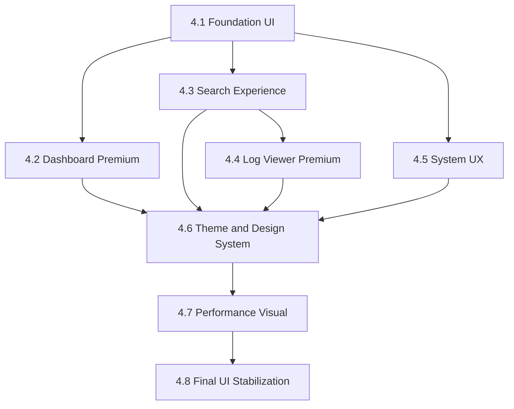

# Fase 4 — UI Premium PyQt5

## 1. Objetivo da Fase 4

Transformar a UI PyQt5 atual em uma interface premium, modular, moderna e preparada para futura migracao hibrida Electron/React. A entrega e visual e estrutural, sem alterar regras de negocio, contratos publicos de services, threads, banco ou esquema do indice.

A Fase 4 consolida o trabalho da Fase 3 (busca hibrida, indexacao, baseline reproduzivel) entregando uma camada de apresentacao desacoplada, documentada e revertivel.

## 2. Problemas atuais da UI

- Monolito visual em `src/app_desktop/ui_main.py` com aproximadamente 1.580 linhas e responsabilidades misturadas.
- Estilos inline duplicados via `setStyleSheet(...)` em multiplos botoes/containers — drift visual e dificuldade de manutencao.
- `src/app_desktop/style.qss` minimalista (cerca de 35 linhas), com seletores por `objectName` espalhados — sem tokens, sem hierarquia, sem variacoes.
- Dialogos criados ad-hoc dentro de `ui_main.py` (`LoginDialog`, `DialogNovaSolucao`, dialog de edicao de usuario inline, dialog de novo modelo via `QInputDialog`) — sem reuso.
- Status bar e a unica forma de feedback para operacoes longas; nao ha sistema de toast/notificacoes.
- Sem progress overlays para reindex e busca; usuario nao tem indicador visual claro de progresso.
- Nao ha tema (light/dark) nem tokens de design (cores, spacing, typography).
- ViewModels inexistentes; widgets falam diretamente com application services.
- Logica de filtros/conversoes (datas, cores de fase) embutida nos slots de UI, dificultando teste isolado e portabilidade futura para React.

## 3. Limitacoes atuais do `ui_main.py`

- Funcoes `setup_*` longas, varias acima de 100 linhas.
- `MainApp.__init__` instancia ~10 services diretamente; sem injecao de dependencia formal — dificulta teste isolado.
- Lazy loading existe somente no startup via `_run_post_startup_tasks`; abas pesadas sao montadas no `init_ui` mesmo quando ocultas.
- Sinais de threads conectados a slots ad-hoc em metodos da `MainApp`; sem padronizacao de eventos UI.
- Ausencia de padrao MVVM — estado e formatacao acoplados aos widgets.
- `QSS` aplicado em runtime mistura inline + `style.qss`; coerencia visual depende do desenvolvedor lembrar do padrao.

## 4. Estrategia arquitetural da UI

- Adotar MVVM leve em PyQt5:
  - `viewmodels/` mantem estado, formata dados e delega para application services.
  - Widgets em `widgets/` apenas renderizam estado e emitem sinais de intencao do usuario.
- Sinais Qt explicitos entre ViewModel e Widget (ex.: `searchRequested`, `reindexRequested`); sem chamadas diretas a services dentro de widgets.
- Injecao de dependencia por construtor: ViewModels recebem services no `__init__`; facilita testes e troca de bridges no futuro Electron/React.
- `MainWindow` (atual `MainApp`) reduzida a um shell de navegacao + carregamento lazy de paginas em `pages/`.
- Threads (`BuscaThread`, `FileLoaderThread`, `DashboardThread`, `ReindexThread`) permanecem em `src/app_desktop/threads.py` com contratos inalterados; ViewModels orquestram conexoes.

## 5. Estrategia de componentizacao

Componentes organizados por responsabilidade:

- `widgets/`: componentes reutilizaveis sem regra de negocio (ex.: `PrimaryButton`, `Card`, `StatusBadge`, `ProgressOverlay`, `Toast`, `MetricCard`).
- `dialogs/`: dialogos reutilizaveis (`LoginDialog`, `ChangePasswordDialog`, `EditUserDialog`, `NewSolutionDialog`).
- `layouts/`: layouts compostos (`MasterDetailLayout`, `SearchLayout`).
- `pages/`: paginas de aba (`FinderPage`, `KnowledgeBasePage`, `HistoryPage`, `AdminPage`, `ConfigPage`).
- `themes/`: tokens de design + QSS modular por tema.
- `assets/`: icones e recursos visuais.
- `viewmodels/`: estado e logica de apresentacao.

Regras gerais de componentizacao:

- 1 widget = 1 responsabilidade visual.
- Widgets nao instanciam services.
- Widgets nao formatam datas, status ou cores: formatacao vai para ViewModel.
- Estilos consumidos via `objectName` ou classe semantica, nunca inline.

## 6. Estrategia visual

- Substituir o QSS atual por sistema baseado em tokens.
- 1 tema padrao "ICT Light" + 1 tema "ICT Dark" como opcional.
- Tipografia consistente (1 family Sans para UI + 1 mono para code/log).
- Spacing scale: `4 / 8 / 12 / 16 / 24 / 32` aplicada em todos os layouts.
- Componentes com estados claros: `default`, `hover`, `active`, `disabled`, `loading`.
- Linguagem de cores:
  - primaria: azul corporativo
  - sucesso: verde
  - erro: vermelho
  - aviso: ambar
  - info/neutro: cinza claro
- Icones via `assets/` em PNG/SVG normalizados; eliminar emojis hardcoded em botoes quando possivel.

## 7. Estrategia de desacoplamento

- Substituir `setStyleSheet(...)` inline por classes/objectName com QSS centralizado em `themes/`.
- Mover dialogos inline (`LoginDialog`, edicao de usuario, novo modelo, nova solucao) para `dialogs/`.
- Extrair logica de filtros wiki, paginacao e busca para ViewModel correspondente.
- Substituir conexoes diretas thread -> slot por sinais que passam pelo ViewModel.
- Conversao de dados (datas, status colors, mensagens de status bar) sai dos widgets e vai para ViewModel.
- ViewModels expoem metodos com nomes em verbos de dominio para facilitar paridade Electron/React (`searchRequested`, `reindexRequested`, `userSelected`).

## 8. Estrategia de performance visual

- Lazy loading de paginas: `HistoryPage` e `AdminPage` so sao instanciadas no primeiro `setCurrentIndex`.
- `setUpdatesEnabled(False)` em tabelas grandes durante `populate_*` (padrao ja usado em `popular_tabela_tri`).
- Throttle/debounce na busca por sintoma na wiki (atual `textChanged` dispara em todo keystroke).
- Avaliar substituir loops de `setItem` em tabelas grandes por modelos `QAbstractTableModel` na 4.4 (so se houver ganho real medido).
- Estados de `loading` com `ProgressOverlay` evitando bloqueio visual e cliques duplos.
- Manter `startup_profiler` e `_run_post_startup_tasks` como ponto unico de IO pesado pos-render.

## 9. Estrategia de preparacao para Electron/React

- ViewModels desenham contrato que sera espelhado em hooks React (`useFinderViewModel`, `useKnowledgeBaseViewModel`).
- Widgets apenas renderizam estado — paridade direta com componentes React.
- Tokens de design ficam em arquivo neutro (Python + JSON serializavel), facilitando exportacao para CSS/Tailwind config.
- Eventos UI sao sinais Qt nomeados em verbos de dominio (`searchRequested`, `reindexRequested`) reaproveitaveis em IPC futuro.
- Dialogos seguem padroes que mapeiam 1-para-1 em modais React.
- Mensagens de status bar e toasts sao emitidas pelo ViewModel — facilita troca para `useToast()` em React sem reescrever logica.

## 10. Estrutura futura recomendada da UI

```
src/app_desktop/
  ui_main.py             # shell + bootstrap (reduzido)
  threads.py             # workers (sem mudanca funcional)
  widgets/
    __init__.py
    primary_button.py
    card.py
    status_badge.py
    metric_card.py
    progress_overlay.py
    toast.py
  dialogs/
    __init__.py
    login_dialog.py
    change_password_dialog.py
    edit_user_dialog.py
    new_solution_dialog.py
  layouts/
    __init__.py
    master_detail_layout.py
    search_layout.py
  pages/
    __init__.py
    finder_page.py
    knowledge_base_page.py
    history_page.py
    admin_page.py
    config_page.py
  themes/
    __init__.py
    tokens.py
    base.qss
    light.qss
    dark.qss
  assets/
    icon.ico
    ...
  viewmodels/
    __init__.py
    finder_viewmodel.py
    knowledge_base_viewmodel.py
    history_viewmodel.py
    admin_viewmodel.py
    config_viewmodel.py
```

## 11. Lista completa de subfases

Cada subfase tem objetivo, arquivos provaveis, riscos, impacto, testes, criterios de conclusao, rollback e commit sugerido.

### 4.1 Foundation UI

- Status: Iniciada em 2026-05-06 (parcial). Fundacao visual disponivel (`themes/`, `widgets/`, `layouts/`, `dialogs/`, `pages/`, `viewmodels/`, `assets/`); paginas existentes ainda nao migradas. `style.qss` legado preservado como fallback.
- Objetivo: criar fundacao visual e estrutural reutilizavel.
- Arquivos provaveis:
  - novos: `src/app_desktop/widgets/primary_button.py`, `card.py`, `status_badge.py`, `progress_overlay.py`; `src/app_desktop/themes/tokens.py`, `base.qss`, `light.qss`; `src/app_desktop/layouts/master_detail_layout.py`.
  - alterados: `src/app_desktop/ui_main.py` consumindo tokens em vez de cores hardcoded; carregamento de `base.qss` + `light.qss`.
  - alterado: `src/app_desktop/style.qss` permanece temporariamente como compatibilidade ate 4.8.
- Riscos:
  - quebra visual em telas que dependiam de `style.qss`;
  - regressao em estilos por `objectName`.
- Impacto: base visual e estrutural disponivel para 4.2-4.8.
- Testes:
  - `tests/ui/test_widgets_smoke.py` (novo) com `pytest.importorskip("PyQt5")`.
- Criterio de conclusao: app abre identico em comportamento, com QSS centralizado e widgets reutilizaveis disponiveis; smoke desktop manual aprovado.
- Rollback: `git revert` do commit; `style.qss` antigo permanece como referencia ate 4.8.
- Commit sugerido: `feat(ui): foundation widgets, tokens, base layout`.

### 4.2 Dashboard Premium

- Objetivo: criar dashboard de metricas premium na primeira aba ou aba dedicada (sem alterar logica de negocio).
- Arquivos provaveis:
  - novos: `src/app_desktop/widgets/metric_card.py`; `src/app_desktop/pages/dashboard_page.py`; `src/app_desktop/viewmodels/dashboard_viewmodel.py`.
  - alterados: `src/app_desktop/ui_main.py` substituindo/adicionando dashboard; renomeacao cuidadosa de `tab_dash` (atualmente usado por `setup_knowledge_base`) para evitar conflito.
- Riscos:
  - duplicacao com `setup_knowledge_base` (que reusa `tab_dash`);
  - exposicao acidental de chamadas pesadas a banco no boot.
- Impacto: experiencia inicial mais clara; metricas (total falhas, ultimas analises, status do indice) visiveis em cards.
- Testes:
  - `tests/ui/test_dashboard_viewmodel.py` (novo) com `LogAnalysisService` e `LogIndexApplicationService` mockados.
- Criterio de conclusao: dashboard mostra metricas atualizadas; abertura nao bloqueia UI; comportamento identico das funcoes ja existentes.
- Rollback: `git revert`; nenhuma migracao de dados.
- Commit sugerido: `feat(ui): premium dashboard with metric cards and viewmodel`.

### 4.3 Search Experience (Finder)

- Objetivo: refinar painel de busca, mantendo logica em `LogSearchService`/`BuscaThread`.
- Arquivos provaveis:
  - novos: `src/app_desktop/pages/finder_page.py`, `src/app_desktop/viewmodels/finder_viewmodel.py`, `src/app_desktop/layouts/search_layout.py`, `src/app_desktop/widgets/result_list.py`.
  - alterados: `src/app_desktop/ui_main.py` — `setup_finder` substituido por `FinderPage`.
- Riscos:
  - quebra de `BuscaThread` se sinais forem reconectados incorretamente;
  - perda do feedback de origem (`Busca rapida:` / `Busca em rede:`).
- Impacto: visual moderno, filtros visiveis, feedback de origem destacado.
- Testes:
  - `tests/ui/test_finder_viewmodel.py` (novo) com `BuscaThread` mockada.
- Criterio de conclusao: busca funciona identica; feedback `Busca rapida:`/`Busca em rede:` preservado; status bar global mantida.
- Rollback: `git revert`.
- Commit sugerido: `feat(ui): premium finder page with viewmodel and search layout`.

### 4.4 Log Viewer Premium

- Objetivo: visualizacao moderna do log com syntax highlight leve, painel de metadata e acoes copy/export.
- Arquivos provaveis:
  - novos: `src/app_desktop/widgets/log_viewer.py`, `src/app_desktop/widgets/metadata_panel.py`, `src/app_desktop/widgets/log_actions_bar.py`.
  - alterados: `src/app_desktop/pages/finder_page.py` integrando widgets.
  - tabela TRI: avaliar substituir `QTableWidget` por `QTableView` + modelo dedicado se houver ganho de performance real (decidir na execucao com baseline mensurado).
- Riscos:
  - syntax highlight pode pesar em logs grandes; mitigar com truncamento configuravel + `QPlainTextEdit`;
  - eventual mudanca de `QTableWidget` -> `QTableView` exige reescrever sort/copy.
- Impacto: melhor UX de leitura de log; metadata destacada; copy/export com um clique.
- Testes:
  - `tests/ui/test_log_viewer.py` (novo).
- Criterio de conclusao: log abre, metadata exibida (serial, modelo, status), copy/export funcionam, sem regressao em logs grandes.
- Rollback: `git revert`.
- Commit sugerido: `feat(ui): premium log viewer with metadata panel and actions`.

### 4.5 System UX (dialogs, notifications, overlays, progress)

- Objetivo: padronizar feedback de sistema.
- Arquivos provaveis:
  - novos: `src/app_desktop/widgets/toast.py`, `src/app_desktop/widgets/progress_overlay.py`, `src/app_desktop/dialogs/*.py` (extracao de `LoginDialog`, edit user, new solution).
  - alterados: callsites em `src/app_desktop/ui_main.py` — `QMessageBox.information(...)` substituido por `Toast.show(...)` em casos nao bloqueantes; manter `QMessageBox` apenas em confirmacoes destrutivas.
- Riscos:
  - regressao em fluxos onde o usuario espera modal bloqueante;
  - vazamento de toasts ao fechar a janela.
- Impacto: progresso visual real para reindex/busca; menos "alert fatigue".
- Testes:
  - `tests/ui/test_toast.py` (novo).
  - `tests/ui/test_progress_overlay.py` (novo).
- Criterio de conclusao: reindex pela UI mostra progress overlay; toasts substituem alertas nao criticos; comportamento identico em confirmacoes destrutivas.
- Rollback: `git revert`; comportamento volta a `QMessageBox` puro.
- Commit sugerido: `feat(ui): unified system ux with toasts, overlays and modular dialogs`.

### 4.6 Theme & Design System

- Objetivo: consolidar tokens, tema light/dark e QSS modular.
- Arquivos provaveis:
  - novos/alterados: `src/app_desktop/themes/tokens.py`, `light.qss`, `dark.qss`, `base.qss`.
  - alterados: `src/app_desktop/ui_main.py` + paginas: usar `theme.apply(app, "light"|"dark")`.
  - alterado: `src/core/config/config_service.py` — nova chave `ui_theme` (default `light`), sem mudar comportamento padrao.
- Riscos:
  - inconsistencias temporarias entre paginas migradas e legadas durante a transicao; mitigar com ordem topologica (4.1 -> 4.2/4.3/4.5 -> 4.4 -> 4.6).
- Impacto: aparencia unificada e configuravel; base de migracao Electron mais simples.
- Testes:
  - `tests/ui/test_theme_tokens.py` (novo).
  - `tests/core/test_config_ui_theme.py` (novo).
- Criterio de conclusao: trocar tema nao quebra fluxos; QSS sem strings inline em paginas; tokens documentados em `docs/UI_DESIGN_SYSTEM.md`.
- Rollback: `git revert`; configuracao volta a `style.qss` antigo.
- Commit sugerido: `feat(ui): theme system with tokens and light/dark variants`.

### 4.7 Performance Visual

- Objetivo: lazy loading, redraw optimization, worker-safe updates.
- Arquivos provaveis:
  - alterados: `src/app_desktop/ui_main.py` — `init_ui` cria abas mas paginas pesadas so sao instanciadas no primeiro `currentChanged`.
  - alterados: paginas com tabela grande (TRI/wiki) recebem `setUpdatesEnabled(False)` em batch.
  - novos: `src/app_desktop/widgets/lazy_tab.py` (envoltorio que materializa a pagina sob demanda).
- Riscos:
  - eventos antes do lazy load podem falhar; mitigar com guards e materializacao sob demanda.
- Impacto: startup ainda mais rapido; scroll/redraw fluido.
- Testes:
  - `tests/ui/test_lazy_tab.py` (novo).
- Criterio de conclusao: `startup_profiler` registra ganho mensuravel; `dev_check` ok.
- Rollback: `git revert`.
- Commit sugerido: `perf(ui): lazy load pages and optimize redraws`.

### 4.8 Final UI Stabilization

- Objetivo: smoke UI, consistencia visual, responsividade, cleanup de dead code.
- Arquivos provaveis:
  - removidos: `src/app_desktop/style.qss` (apos verificar zero referencias).
  - alterados: `src/app_desktop/ui_main.py` reduzido a aproximadamente 300-400 linhas (apenas shell de navegacao).
  - novos: `docs/SMOKE_UI_PREMIUM.md` (checklist visual + responsivo), `docs/UI_DESIGN_SYSTEM.md` (referencia de tokens).
- Riscos:
  - remocao prematura de `style.qss` antes de migrar todas as paginas; mitigar mantendo arquivo ate o ultimo passo.
- Impacto: UI premium consolidada e documentada; base ideal para iniciar Fase 5/6.
- Testes:
  - `tests/ui/test_main_app_smoke.py` (novo) com `pytest.importorskip("PyQt5")` abrindo `MainApp` sem rede.
- Criterio de conclusao: `dev_check` verde; smoke UI manual aprovado em pelo menos 1 ambiente; `ui_main.py` reduzido.
- Rollback: `git revert`.
- Commit sugerido: `chore(ui): finalize phase 4 with smoke checklist and design system docs`.

## 12. Guidelines obrigatorias da Fase 4

- Nao quebrar contratos publicos de:
  - `src/application/services/log_search_service.py` (`search_with_index`, `timed_search_with_index`, `should_include_file`, `limit_results`, `build_summary_message`, `is_index_ready`).
  - `src/application/services/log_index_application_service.py`.
  - `src/app_desktop/threads.py` (`BuscaThread.lista_arquivos`, `search_summary`, `ReindexThread.progress_msg`/`finished_summary`/`failed`).
  - Demais application services (`AuthApplicationService`, `WikiService`, `ReportApplicationService`, `SyncApplicationService`, `DatabaseApplicationService`, `LogAnalysisService`).
- Nao alterar logica de negocio em `src/core` ou `src/application`.
- Separar UI de services: widgets jamais chamam repositorios diretamente.
- Evitar logica pesada em widgets: deve ficar em `viewmodels/`.
- Evitar acoplamento visual: nada de `setStyleSheet(...)` inline em widgets — usar tokens/QSS.
- Nao tocar em `legacy/`.
- Nao alterar esquema do banco SQLite (remoto, espelho, fila offline, indice).
- Nao adicionar dependencias novas em `requirements.txt` sem justificativa explicita e aprovada.
- Cada subfase entrega um commit unico e revertivel; rollbacks por `git revert`.
- Manter 100% dos testes existentes verdes; novos testes por subfase usam `pytest.importorskip("PyQt5")` para nao bloquear CI futuro.
- Manter `startup_profiler` ativo em `run_desktop.py` e `ui_main.py`; nao perder visibilidade de boot.
- Manter `_run_post_startup_tasks` como ponto unico de IO pesado pos-render.
- Manter o feedback de origem da busca (`Busca rapida:` / `Busca em rede:`) visivel ao usuario.
- Mensagens de validacao funcional (login, salvar analise, exportar excel) podem mudar de container visual, mas nao em conteudo nem em fluxo.

## 13. Criterios para considerar a UI "premium-ready"

A UI sera considerada premium-ready quando, simultaneamente:

1. `ui_main.py` reduzido a shell (alvo: < 400 linhas) com paginas em `pages/`.
2. Zero `setStyleSheet(...)` inline em widgets de paginas (auditavel via grep simples).
3. `style.qss` antigo substituido por `themes/` (light + dark) e removido.
4. Todas as 5 paginas (`Finder`, `KnowledgeBase`, `History`, `Admin`, `Config`) com `viewmodel` correspondente em `viewmodels/`.
5. `Toast` e `ProgressOverlay` em uso para feedback nao bloqueante.
6. Lazy loading ativo em paginas pesadas (`History`, `Admin`).
7. `tests/ui/` com smoke test de cada pagina passando localmente (com `pytest.importorskip("PyQt5")`).
8. `docs/SMOKE_UI_PREMIUM.md` aprovado em pelo menos 1 ambiente real.
9. `docs/UI_DESIGN_SYSTEM.md` publicado com tokens, cores e tipografia.
10. Nenhuma regressao funcional medida pelo `docs/SMOKE_TEST_DESKTOP.md` e `docs/VALIDACAO_INDEXACAO_BUSCA_RAPIDA.md`.

## 14. Criterios para futura migracao Electron/React

A Fase 4 deve deixar o terreno preparado para que a Fase 6 possa:

1. Mapear cada `pages/*.py` para uma pagina React 1:1.
2. Reusar tokens de `themes/tokens.py` como base do design system web (ex.: exportar para Tailwind/JSON).
3. Reaproveitar `viewmodels/*.py` como contratos de dados — hooks React (`useFinderViewModel`) consomem mesmo shape via IPC.
4. Sinais Qt nomeados em verbos de dominio (`searchRequested`, `reindexRequested`) viram eventos IPC com mesmo nome.
5. Dialogos modulares (`dialogs/*.py`) viram componentes React em `apps/web-ui/components/dialogs/`.
6. Application services Python permanecem inalterados — apenas a UI muda de stack.
7. Estrutura `widgets/`, `pages/`, `viewmodels/`, `themes/`, `dialogs/` mapeavel diretamente para `apps/web-ui/{components,pages,hooks,themes,dialogs}/`.

## 15. Ordem ideal de execucao



Justificativa:

- 4.1 antes de tudo: tokens, widgets base, layout master-detail formam a fundacao.
- 4.2 / 4.3 / 4.5 podem rodar em paralelo apos 4.1.
- 4.4 depende de 4.3 (Finder e o consumidor do log viewer premium).
- 4.6 consolida estilos somente apos paginas migradas.
- 4.7 otimiza performance visual apos consolidacao.
- 4.8 fecha com smoke + cleanup.

## 16. O que NAO deve ser alterado durante esta fase

- Logica de busca em `src/app_desktop/threads.py` (`BuscaThread`, `FileLoaderThread`, `DashboardThread`, `ReindexThread`).
- Application services em `src/application/services/`.
- Core em `src/core/`.
- Esquema SQLite (remoto, espelho local, fila offline, indice).
- Pasta `legacy/`.
- Conteudo das mensagens funcionais (login, salvar analise, exportar excel) — apenas o container visual pode mudar.
- `run_desktop.py` (apenas pequenas marcacoes de `startup_profiler` se necessario).
- Politica de reindex e indexacao (definidas pela Fase 3 e por documentos derivados).

## 17. Estrategia de rollback geral

- Cada subfase entrega 1 commit isolado e revertivel.
- Em caso de regressao detectada por `dev_check` ou smoke desktop, reverter o commit da subfase falha sem afetar as anteriores.
- `style.qss` antigo so e removido na 4.8 — antes disso, a configuracao continua disponivel como porto seguro.
- Testes que dependem de PyQt5 usam `pytest.importorskip("PyQt5")` para nao quebrar CI futuro em runners headless.
- ViewModels novos podem ser desativados temporariamente caso causem instabilidade — chave de feature flag opcional em `config_service` so se necessario; default sempre off.

## 18. Estrategia de testes

- Manter padrao atual de `tests/` — separacao por dominio.
- Cada subfase introduz pelo menos 1 arquivo de teste novo.
- Adicionar pasta `tests/ui/` para smoke tests de widgets/paginas/viewmodels usando `pytest.importorskip("PyQt5")`.
- Novos testes nunca dependem de banco real ou rede; sempre mocks.
- Continuar usando `scripts/dev_check.bat` como pipeline local minimo.
- Pretty regression: rodar `docs/SMOKE_TEST_DESKTOP.md` ao fim de cada subfase com impacto visual relevante.

## 19. Estrategia de validacao operacional

- Apos cada subfase: rodar `scripts\dev_check.bat`.
- Apos 4.2/4.3/4.4: refazer secoes especificas de `docs/SMOKE_TEST_DESKTOP.md`.
- Apos 4.6: validar troca de tema light/dark sem regressao.
- Apos 4.7: capturar relatorio do `startup_profiler` antes e depois para registrar ganho.
- Apos 4.8: executar `docs/VALIDACAO_INDEXACAO_BUSCA_RAPIDA.md` e novo `docs/SMOKE_UI_PREMIUM.md` em pelo menos 1 ambiente real.
- Atualizar `docs/PROJECT_EVOLUTION_LOG.md` ao fim de cada subfase com a entrada datada correspondente.

## 20. Riscos tecnicos da fase

- R1 — Quebra silenciosa de estilos por `objectName` durante migracao para `themes/`: mitigar com inventario inicial dos `objectName` e migracao gradual.
- R2 — Sinais de threads (`BuscaThread`, `ReindexThread`) reconectados em paginas/viewmodels com nomes errados: mitigar com testes de viewmodel mockando threads.
- R3 — Lazy loading mascarando bugs ate o usuario abrir a aba: mitigar com smoke test que abre todas as abas em ordem.
- R4 — Toast/Overlay vazando ao fechar janela: mitigar com cleanup explicito em `closeEvent`.
- R5 — Tema dark causando contraste ruim em widgets terceiros (QChart): mitigar mantendo `light` como default e auditando contraste antes de liberar `dark`.

## 21. Debitos tecnicos relacionados (fora do escopo direto, mapeados)

- Falha pre-existente em `tests/parsers/test_tri_parser.py::test_parse_tri_txt_pass_serial_modelo` — registrar issue para corrigir em fase paralela.
- Hardening de admin (troca de senha default) e build reprodutivel — itens originalmente planejados como Fase 4 alternativa, agora realocados para fase paralela executada antes de releases de produto.
- Pin de `requirements.txt` permanece como debito ate a fase paralela de Hardening.
- Logging estruturado (substituicao de `print(...)`) permanece como debito pre-Electron.

## 22. Dependencias futuras (esta fase habilita)

- Fase 5 — API local opcional: bridge IPC reusa ViewModels e contratos de eventos definidos aqui.
- Fase 6 — Arquitetura hibrida (Electron + React): paridade direta widget/viewmodel/page.
- Fase 7 — Desacoplamento total: `src/app_desktop/` pode ser congelado/movido com facilidade pois shell ja esta enxuto.

## 23. Criterio para considerar a Fase 4 concluida

A Fase 4 estara concluida quando todos os 8 commits sugeridos estiverem integrados ao `main`, `dev_check.bat` estiver verde, criterios de "premium-ready" da secao 13 forem atendidos e os criterios de preparacao Electron/React da secao 14 forem auditaveis nos diretorios `pages/`, `viewmodels/`, `widgets/`, `themes/`, `dialogs/`.

## Apendice — entrada proposta para `docs/PROJECT_EVOLUTION_LOG.md`

```markdown
### [2026-05-06] — [Phase Planning] — Planejamento completo da Fase 4 UI Premium
- Objetivo: planejar (sem executar) a Fase 4 — transformar a UI PyQt5 atual em interface premium, modular, moderna e preparada para futura migracao Electron/React.
- Prompt aplicado/resumo: revisao integrada de docs/MASTER_EXECUTION_PLAN.md, docs/PROJECT_EVOLUTION_LOG.md, ROADMAP.md, CHANGELOG.md, docs/VALIDACAO_INDEXACAO_BUSCA_RAPIDA.md, docs/BASELINE_BUSCA.md, src/app_desktop/ui_main.py, src/app_desktop/threads.py, src/app_desktop/style.qss; consolidacao em docs/PHASE_4_UI_PREMIUM_PLAN.md cobrindo 8 subfases (Foundation UI, Dashboard Premium, Search Experience, Log Viewer Premium, System UX, Theme and Design System, Performance Visual, Final UI Stabilization), guidelines obrigatorias, criterios premium-ready e criterios para futura migracao Electron/React.
- Arquivos principais: `docs/PHASE_4_UI_PREMIUM_PLAN.md`, `docs/PROJECT_EVOLUTION_LOG.md`.
- Commit: nao foi feito commit nesta tarefa de planejamento.
- Testes/validacao: nao se aplica; nenhum codigo alterado.
- Observacoes: a Fase 4 do master plan original (UI Premium) e mantida; Hardening e build reprodutivel passam a ser fase paralela executada antes de releases.
- Proximo passo: aprovar o documento e iniciar pela Subfase 4.1 (Foundation UI).
```
